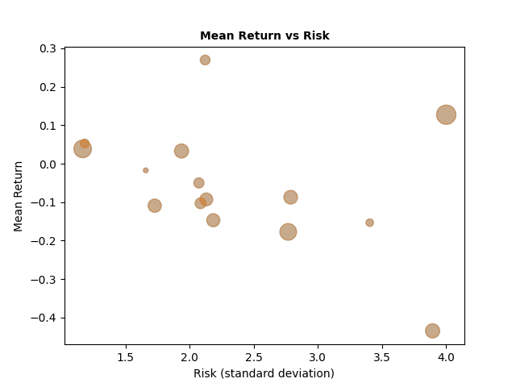

Describe:
shape: (1, 15)
┌───────────┬──────────┬──────────┬──────────┬───┬──────────┬──────────┬──────────┬──────────┐
│ JPM       ┆ XOM      ┆ CRM      ┆ AMZN     ┆ … ┆ NKE      ┆ SBUX     ┆ T        ┆ KO       │
│ ---       ┆ ---      ┆ ---      ┆ ---      ┆   ┆ ---      ┆ ---      ┆ ---      ┆ ---      │
│ f64       ┆ f64      ┆ f64      ┆ f64      ┆   ┆ f64      ┆ f64      ┆ f64      ┆ f64      │
╞═══════════╪══════════╪══════════╪══════════╪═══╪══════════╪══════════╪══════════╪══════════╡
│ 139.21747 ┆ 78.50219 ┆ 211.0149 ┆ 153.8932 ┆ … ┆ 135.6521 ┆ 89.97995 ┆ 18.38999 ┆ 59.69179 │
│ 6         ┆          ┆ 99       ┆ 5        ┆   ┆ 07       ┆ 8        ┆ 9        ┆ 7        │
└───────────┴──────────┴──────────┴──────────┴───┴──────────┴──────────┴──────────┴──────────┘

Median:
shape: (9, 16)
┌───────────┬──────────┬──────────┬──────────┬───┬──────────┬──────────┬──────────┬──────────┐
│ statistic ┆ JPM      ┆ XOM      ┆ CRM      ┆ … ┆ NKE      ┆ SBUX     ┆ T        ┆ KO       │
│ ---       ┆ ---      ┆ ---      ┆ ---      ┆   ┆ ---      ┆ ---      ┆ ---      ┆ ---      │
│ str       ┆ f64      ┆ f64      ┆ f64      ┆   ┆ f64      ┆ f64      ┆ f64      ┆ f64      │
╞═══════════╪══════════╪══════════╪══════════╪═══╪══════════╪══════════╪══════════╪══════════╡
│ count     ┆ 252.0    ┆ 252.0    ┆ 252.0    ┆ … ┆ 252.0    ┆ 252.0    ┆ 252.0    ┆ 252.0    │
│ null_coun ┆ 0.0      ┆ 0.0      ┆ 0.0      ┆ … ┆ 0.0      ┆ 0.0      ┆ 0.0      ┆ 0.0      │
│ t         ┆          ┆          ┆          ┆   ┆          ┆          ┆          ┆          │
│ mean      ┆ 139.3457 ┆ 75.71046 ┆ 220.2038 ┆ … ┆ 136.4938 ┆ 93.28473 ┆ 18.57255 ┆ 58.97344 │
│           ┆ 59       ┆          ┆ 49       ┆   ┆ 14       ┆ 1        ┆ 4        ┆ 9        │
│ std       ┆ 18.90087 ┆ 14.25503 ┆ 45.92113 ┆ … ┆ 22.26980 ┆ 14.76279 ┆ 1.213985 ┆ 4.082618 │
│           ┆ 7        ┆ 6        ┆ 6        ┆   ┆ 9        ┆          ┆          ┆          │
│ min       ┆ 108.0    ┆ 51.31893 ┆ 155.6000 ┆ … ┆ 100.8902 ┆ 69.17585 ┆ 15.86022 ┆ 50.92875 │
│           ┆          ┆ 5        ┆ 06       ┆   ┆ 05       ┆ 8        ┆ 2        ┆ 3        │
│ 25%       ┆ 120.7915 ┆ 61.09365 ┆ 181.3099 ┆ … ┆ 114.1521 ┆ 79.66183 ┆ 17.67112 ┆ 54.83067 │
│           ┆ 19       ┆ 1        ┆ 98       ┆   ┆ 15       ┆ 5        ┆          ┆ 3        │
│ 50%       ┆ 139.5225 ┆ 78.63269 ┆ 211.0299 ┆ … ┆ 135.7910 ┆ 90.07869 ┆ 18.38999 ┆ 59.70647 │
│           ┆ 07       ┆ 8        ┆ 99       ┆   ┆ 46       ┆ 7        ┆ 9        ┆          │
│ 75%       ┆ 156.0020 ┆ 86.70753 ┆ 259.1700 ┆ … ┆ 157.2718 ┆ 109.4291 ┆ 19.26342 ┆ 62.45465 │
│           ┆ 14       ┆ 5        ┆ 13       ┆   ┆ 66       ┆ 53       ┆ 6        ┆ 5        │
│ max       ┆ 168.0138 ┆ 103.5835 ┆ 309.9599 ┆ … ┆ 175.8461 ┆ 116.7361 ┆ 21.03976 ┆ 65.25927 │
│           ┆ 7        ┆ 49       ┆ 91       ┆   ┆          ┆ 6        ┆ 6        ┆ 7        │
└───────────┴──────────┴──────────┴──────────┴───┴──────────┴──────────┴──────────┴──────────┘

